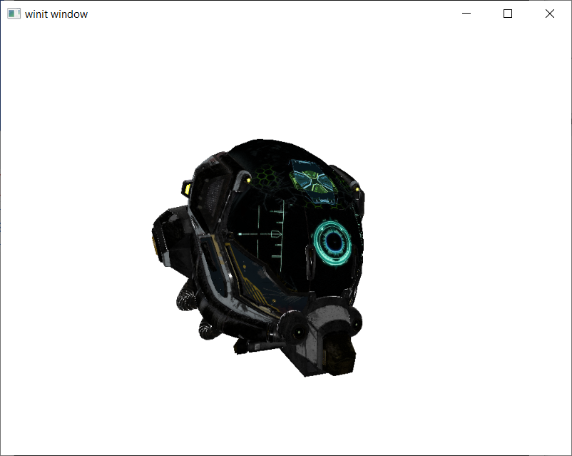
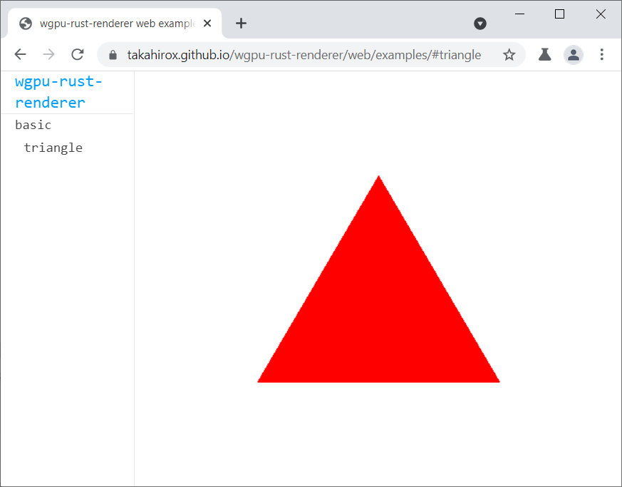

[](https://travis-ci.org/takahirox/wgpu-rust-renderer)
[](https://crates.io/crates/wgpu_rust_renderer)

# wgpu-rust-renderer

`wgpu-rust-renderer` is a tiny [WebGPU](https://www.w3.org/TR/webgpu/) Renderer written in Rust.

## Demo

[Online WebAssembly Demo](https://takahirox.github.io/wgpu-rust-renderer/web/examples/#triangle)

Rust code is compiled to WebAssembly with [wasm-bindgen](https://rustwasm.github.io/wasm-bindgen/) and it runs even in web browsers.

## Screenshots

Desktop application.



Web application.



## Features

* Tiny WebGPU Renderling library
* Easy to use
* Memory safe with Rust
* [glTF](https://www.khronos.org/gltf/) support
* Good flexibility and extensibility of materials with node-based material system
* Web application compatible by compiling to WebAssembly

## Documentation

T.B.D.

## Sample Code

```rust
use winit::{
  event::{Event, WindowEvent},
  event_loop::{ControlFlow, EventLoop},
  window::Window,
};
use wgpu_rust_renderer::{
  math::color::Color,
  renderer::wgpu_renderer::{
    WGPURenderer,
    WGPURendererOptions,
  },
  resource::resource::{
    ResourceId,
    ResourcePools,
  },
  scene::{
    camera::PerspectiveCamera,
    mesh::Mesh,
    node::Node,
    scene::Scene,
  },
  utils::{
    geometry_helper::GeometryHelper,
    material_helper::MaterialHelper,
  },
};

fn create_scene(
  window: &Window,
  pools: &mut ResourcePools,
) -> (ResourceId<Scene>, ResourceId<PerspectiveCamera>) {
  let mut scene = Scene::new();

  let geometry = GeometryHelper::create_triangle(
    pools,
    1.0,
    1.0,
  );

  let material = MaterialHelper::create_basic_material(
    pools,
    Color::set(&mut Color::create(), 1.0, 0.0, 0.0),
  );

  let mesh = pools.borrow_mut::<Mesh>()
    .add(Mesh::new(geometry, material));
  let node = pools.borrow_mut::<Node>()
    .add(Node::new());
  scene.add_node(&node);
  scene.assign(&node, &mesh);

  let window_size = window.inner_size();
  let camera = pools.borrow_mut::<PerspectiveCamera>().add(
    PerspectiveCamera::new(
      60.0_f32.to_radians(),
      window_size.width as f32 / window_size.height as f32,
      0.1,
      1000.0,
    ),
  );

  let mut node = Node::new();
  node.borrow_position_mut()[2] = 1.0;

  let node = pools.borrow_mut::<Node>().add(node);
  scene.add_node(&node);
  scene.assign(&node, &camera);

  (pools.borrow_mut::<Scene>().add(scene), camera)
}

fn resize(
  renderer: &mut WGPURenderer,
  pools: &mut ResourcePools,
  camera: &ResourceId<PerspectiveCamera>,
  width: u32,
  height: u32,
) {
  pools
    .borrow_mut::<PerspectiveCamera>()
    .borrow_mut(camera)
    .unwrap()
    .set_aspect(width as f32 / height as f32);
  renderer.set_size(width as f64, height as f64);
}

fn update(
  pools: &mut ResourcePools,
  scene: &ResourceId<Scene>,
) {
  pools.borrow::<Scene>()
    .borrow(scene)
    .unwrap()
    .update_matrices(pools);
}

fn render(
  renderer: &mut WGPURenderer,
  pools: &ResourcePools,
  scene: &ResourceId<Scene>,
  camera: &ResourceId<PerspectiveCamera>,
) {
  renderer.render(pools, scene, camera);
}

#[tokio::main]
async fn main() {
  let event_loop = EventLoop::new();
  let window = Window::new(&event_loop).unwrap();

  let window_size = window.inner_size();
  let pixel_ratio = window.scale_factor();

  let mut renderer = WGPURenderer::new(
    &window,
    WGPURendererOptions::default(),
  ).await;
  renderer.set_size(window_size.width as f64, window_size.height as f64);
  renderer.set_pixel_ratio(pixel_ratio);

  let mut pools = ResourcePools::new();
  let (scene, camera) = create_scene(&window, &mut pools);

  event_loop.run(move |event, _, control_flow| {
    *control_flow = ControlFlow::Wait;
    match event {
      Event::WindowEvent {
        event: WindowEvent::Resized(size),
        ..
      } => {
        resize(&mut renderer, &mut pools, &camera, size.width, size.height);
        update(&mut pools, &scene);
        render(&mut renderer, &mut pools, &scene, &camera);
      },
      Event::RedrawRequested(_) => {
        update(&mut pools, &scene);
        render(&mut renderer, &mut pools, &scene, &camera);
      },
      Event::WindowEvent {
        event: WindowEvent::CloseRequested,
        ..
      } => {
        *control_flow = ControlFlow::Exit;
      },
      _ => {}
    }
  });
}
```

## How to import

The library is released at [crates.io](https://crates.io/crates/wgpu_rust_renderer). Add the following line into Cargo.toml of your Rust project.

```
[dependencies]
wgpu_rust_renderer = "0.0.4"
```

And add the following lines in your Rust code to import the library.

```Rust
use wgpu_rust_renderer::{
  geometry::{
    attribute::Attribute,
    geometry::Geometry,
    index::Index,
  },
  material::material::Material,
  resource::resource::{
    ResourceId,
    ResourcePools,
  },
  scene::{
    camera::PerspectiveCamera,
    mesh::Mesh,
    node::Node,
    scene::Scene,
  },
  web::wgpu_web_renderer::WGPUWebRenderer, // for web
  renderer::wgpu_renderer::{
    WGPURenderer, // for others
    WGPURendererOptions,
  },
};
```

## How to build the library locally

```sh
$ git clone https://github.com/takahirox/wgpu-rust-renderer.git
$ cd wgpu-rust-renderer
$ cargo build
```

## How to run desktop examples locally

```sh
$ cd wgpu-rust-renderer
$ cargo run --example example_name
```

## How to run web examples locally

Prerequirements
- Install [wasm-bindgen client](https://rustwasm.github.io/docs/wasm-bindgen/)
- Install Rust wasm32-unknown-unknown target with `$ rustup target add wasm32-unknown-unknown`
- Install `http-server` with `$ npm install -g http-server`, or other local servers

```sh
$ cd wgpu-rust-renderer/web
$ bash build_examples.sh
$ http-server . -p 8080 -c-1
# Access http://localhost:8080/examples/index.html on your web browser
```

## How to run tests

T.B.D.
